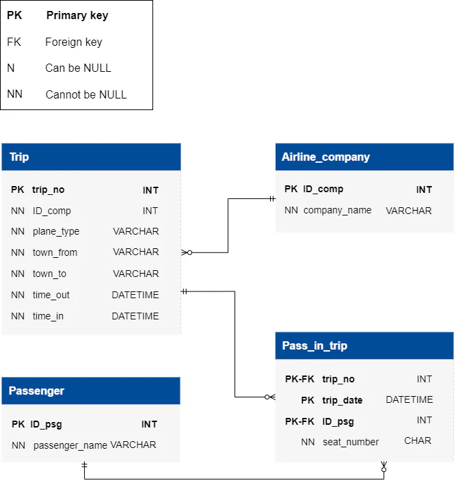

# Airline Transportation

- [Airline Transportation](#airline-transportation)
  - [Learning outcomes](#learning-outcomes)
  - [About](#about)
  - [Stages](#stages)
    - [1: Updating Passenger Trip Dates](#1-updating-passenger-trip-dates)
    - [2: Identifying Key Passengers](#2-identifying-key-passengers)

## Learning outcomes
Embark on a journey of SQL mastery with the Airline Transportation Database project! Explore Intermediate topics including JOINs, set operations, window functions, and table manipulation techniques such as UPDATE and ALTER TABLE commands. Learn to analyze data comprehensively, employ WITH statements for temporary result sets, utilize string operations for data manipulation, and leverage window functions for deeper insights. This project offers a platform to refine your SQL skills, equipping you to tackle complex analytical tasks, optimize airline operations efficiently, and manipulate database structures effectively. Furthermore, to assist you in grasping the topics and efficiently crafting queries, we'll provide examples of ChatGPT prompts. These examples will help you understand how to use the AI tools in you work effectively.

## About
Welcome to the Airline Transportation Database! Here, you'll dive into detailed records about airline companies, trip specifics, and passenger details. Your task as a novice data analyst is to analyze this wealth of data to improve airline operations and enhance passenger experiences. Additionally, with advanced AI tools like ChatGPT at your disposal, you will be able effortlessly craft queries to extract valuable insights and make informed decisions. Let's embark on this journey to optimize air travel together!

## Stages
### 1: Updating Passenger Trip Dates 
<details>
<summary>Alter the passenger's trip table to adjust date data types and synchronize trip dates with departure times to ensure data consistency.</summary>

#### 1.1 Description
As a new data analyst, you're just getting started with the air transportation database. This stage helps you clean up dates and match trip dates with departure times, making the data neat and ready for analysis as you move forward.

#### 1.2 Objectives
- ALTER TABLE the `Pass_in_trip` to change the data type of the `trip_date` column from `DATETIME` to `DATE` for consistency.

- Then, `UPDATE` the `trip_date` in `Pass_in_trip` to adapt it to the new datatype, meaning that you need to change all column values from `DATETIME`("'2024-02-23 00:00:00'") to only `DATE`("2024-02-23").

- Verify the changes by selecting all columns from the updated rows in updated the `Pass_in_trip` table.

- Making multiple queries is allowed.

##### ChatGPT prompts that help to write the query
- How would you modify the data type of a column in a database table to ensure consistency? Consider the scenario where you need to change the data type of a column from one type to another for better alignment across the database.

- Now, assuming you've altered the structure of a database table, how would you use the UPDATE function to modify specific column values, ensuring they align with the new data type?

- After making structural changes to a database table and updating specific column values, how would you verify that the changes were applied correctly? Consider the approach to select and examine the affected rows to ensure the integrity of the data

Take a look at the following database structure:



##### Explanation of the database:
The *`Airline Transportation Database`* encompasses four main tables: `Airline_Company,` `Trip,` `Passenger,` and `Pass_in_trip`. It facilitates the management of airline operations, storing critical information about airline companies, flights, passengers, and trip details.

In-depth details of each table are as follows:

`Airline_company`**: Serves as a repository for airline company information, providing a unique identifier for each company along with their respective names.
- `ID_comp`: Primary key representing the unique identifier for each airline company.
- `company_name`: Stores the name of the airline company, enabling identification and association with flight operations.

`Trip`**: Contains detailed information about each flight trip.
- `trip_no`: Primary key serving as a unique identifier for each flight trip.
- `ID_comp`: Foreign key referencing the `ID_comp` in the `Airline_Company` table, establishing a relationship between flights and airline companies.
- `plane_type`: Records the type of aircraft used for the flight.
- `town_from`: Indicates the departure city of the flight.
- `town_to`: Specifies the arrival city of the flight.
- `time_out`: Stores the departure time of the flight.
- `time_in`: Records the arrival time of the flight.

`Passenger`**: Maintains records of individual passengers.
- `ID_psg`: Primary key representing the unique identifier for each passenger.
- `passenger_name`: Stores the name of the passenger, facilitating passenger identification and management.

`Pass_in_trip`**: Serves as a bridge between passengers and trip details.
- `trip_no`: Foreign key referencing the `trip_no` in the Trip table, establishing a relationship between passengers and flights.
- `trip_date`: Records the date of the trip, allowing for chronological organization of passenger-trip associations.
- `ID_psg`: Foreign key referencing the `ID_psg` in the Passenger table, associating passengers with specific trips.
- `seat_number`: Indicates the seat number occupied by the passenger during the trip, providing seating information for passenger tracking and flight organization.

Additional information and rules to consider:
- flights operate daily, and the flight duration of any flight is less than a day; `town_from` <> `town_to`.
- time and date in the `time_out` and `time_in` are taken into account relative to one-time zone.
- `time_out` and `time_in` times are indicated accurate to the minute.
- `passenger_namemay` have namesakes (same name field values).
- the `seat_number` in the cabin is a number with a letter; the number determines the number of the row in the range from 01 to 99, and the letter (a – d) – the place in the row from left to right in alphabetical order.

** *Table names are case-sensitive*.

Click on the [link](https://cogniterra.org/media/attachments/lesson/38148/Database.sql) to download the SQL query for creating the database.

#### 1.3 Examples
*Pass_in_trip Table Example*:

trip_no|trip_date|ID_psg|seat_number
:-:|:-:|:-:|:-:
1|2024-02-23 00:00:00|1|01A
1|2024-02-23 00:00:00|2|21B
2|2024-02-24 00:00:00|1|30D
2|2024-02-24 00:00:00|2|05C
2|2024-02-24 00:00:00|3|86A

From the data presented in the table above, it can be seen that the datatype of the `trip_date` is the `DATETIME` for example '2024-02-23 00:00:00'. The task is to change the `DATETIME` datatype of the column to the `DATE` datatype and then correspondingly the values of this column change from *`DATETIME`*:*2024-02-23 00:00:00* to *`DATE`*:*2024-02-23*.

The final query output after selecting changed rows with all columns from the `Pass_in_trip` table looks like this:

trip_no|trip_date|ID_psg|seat_number
:-:|:-:|:-:|:-:
1|2024-02-23|1|01A
1|2024-02-23|2|21B
2|2024-02-24|1|30D
2|2024-02-24|2|05C
2|2024-02-24|3|86A

From the output above, it can be seen that all columns from updated rows were selected.

##### Query template:
```sql
ALTER TABLE Pass_in_trip ...;

UPDATE Pass_in_trip ...;

SELECT * ...;
```
[solution](./s01.sql)

</details>

### 2: Identifying Key Passengers
<details>
<summary>Identify the names of passengers who frequently fly with specific airline companies.</summary>

#### 2.1 Description
In this stage as a data analyst, your task is to identify passengers who frequently fly with specific airline companies. By analyzing database records, you'll pinpoint passengers who have flown multiple times with particular airlines. This insight aids airlines in tailoring services to meet the needs of loyal customers.

#### 2.2 Objectives
- Combine passenger flight data from the `Passenger`, `Pass_in_trip`, `Trip`, and `Airline_company` tables to create an overview of frequent flyers with specific airlines.
- Output the `passenger_name`, `COUNT` of the passenger's number of flights on a specific airline company as `num_flights`, and airline `company_name`.
- To be listed as a frequent flyer the `num_flights` must be at least more than 1.
- Utilize the `JOIN` function effectively to combine multiple tables accurately.
- Use the `GROUP BY` function to combine according to the `passneger_name` and `company_name`
- The column order is essential.

##### ChatGPT promts that help to write the query
- Consider a scenario where you need to analyze flight data to identify frequent flyers with specific airlines. How would you effectively merge data from multiple sources using SQL JOINs to gather all the necessary information for analysis?
- Once you've combined the relevant data, how would you use SQL aggregation functions to calculate the number of flights each individual has taken with a particular airline? Think about how you would organize the data to facilitate this calculation.
- To identify frequent flyers accurately, you'll need to filter the results based on certain conditions. How would you utilize SQL clauses to ensure that only individuals who meet the criteria for being frequent flyers are included in the final analysis?

#### 2.3 Examples
*Airline_company Table Example*:
ID_comp|company_name
-|-
1|Delta Airlines
2|American Airlines

*Passenger Table Example*:
ID_psg|passenger_name
-|-
1|John Smith
2|Mary Johnson
3|James Williams

*Trip Table Example*:
trip_no|ID_comp|plane_type|town_from|town_to|time_out|time_in
-|-|-|-|-|-|-
1|1|Boeing 737|Chicago|Miami|2024-02-23 08:00:00|2024-02-23 18:45:00
2|2|Airbus A320|New York|Boston|2024-02-24 23:00:00|2024-02-25 08:00:00

*Pass_in_trip Table Example*:
trip_no|trip_date|ID_psg|seat_number
-|-|-|-
1|2024-02-23 00:00:00|1|01A
1|2024-02-23 00:00:00|1|21B
2|2024-02-24 00:00:00|2|30D
2|2024-02-24 00:00:00|2|05C
2|2024-02-24 00:00:00|3|86A

From the data presented in the table above, it is evident that `passenger_name`: **John Smith** with the `ID_psg`: **1** exists in the `Pass_in_trip` table 2 times. In both cases it aligned to the `trip_no`: **1**, consequently that `trip_no` in the Trip table aligned to the `ID_comp`: **1** which has the `company_name`: **Delta Airlines** in the `Airline_company` table.

The output table, after identifying the `passenger_name` having `num_flights` at least 1 on the specific airline companies :

MySQL Query Output

passenger_name|num_flights|company_name
-|-|-
John Smith|2|Delta Airlines
Mary Johnson|2|American Airlines

*From the output above, it can be seen that the order of the columns is* `passenger_name` -> `num_flights` -> `company_name`

##### Query template:
```sql
SELECT
   p.passenger_name, ...;
```

[solution](./s02.sql)

</details>

[<<](../../../README.md)
<!--
:%s/\(Sample \(Input\|Output\) \d:\)\n\(.*\)/```\r\r**\1**\r```\3/gc
### 0:
<details>
<summary></summary>

#### 0.1 Description

#### 0.2 Objectives

##### ChatGPT promts that help to write the query

#### 0.3 Examples

[solution](./s00.sql)

</details>

-->

