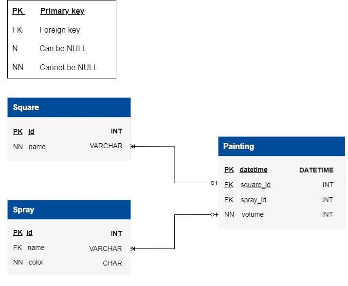

# coloring

- [coloring](#coloring)
  - [learning](#learning)
  - [about](#about)
  - [stages](#stages)
    - [1: never painted squares](#1-never-painted-squares)
    - [2: paint usage by color](#2-paint-usage-by-color)
    - [3: remaining spray volume](#3-remaining-spray-volume)

## learning
start by learning basic sql actions like select, from, group by, and where. move on to understanding sum functions, logical and comparison operators, and then explore more advanced ideas like subqueries and join statements. this learning path is designed to equip you with the skills needed to efficiently fetch important information in sql.

## about
discover the painting database, a tool that keeps it simple to understand how to paint squares with spray cans. pick colors, track how much paint you use, and see how the colors mix on the squares. whether you're just starting or already good at painting, this database makes it easy to learn and have fun with colors.

## stages
### 1: never painted squares
<details>
<summary>find information about squares that have never been painted.</summary>

#### 1.1 description
as a newbie to the world of spray paint, you embark on a journey to explore a canvas made up of never-painted squares. wanting to understand untouched spaces, you seek information about areas that have not yet been decorated with vibrant colors, revealing untouched corners of this creative landscape.

#### 1.2 objectives
- identify the id and `name` of squares that have never been painted from the `square` table in the coloring database. to determine if a square has not been painted, it must be absent in the `painting` table. ensure the results are sorted by square names in descending order. the column order is essential.

take a look at the following database structure:



explanation of the database:

- the square** table represents individual squares that can be painted using spray cans. it contains the following columns:
  - id: a unique identifier for each square.
  - name: the name or label associated with the square.
- the spray** table contains information about different spray paint cans. it includes the following columns:
  - id: a unique identifier for each spray can.
  - name: the name or label associated with the spray can.
  - color: the color of the spray can, is represented only by a single character ('r' for red, 'g' for green, 'b' for blue).
- the painting** table is used to track the painting activity on squares using spray cans. it includes the following columns:
  - datetime: the timestamp indicating when the painting occurred with an accuracy of a second, not milliseconds.
  - square_id: a reference to the square being painted, linking to the id column in the square table.
  - spray_id: a reference to the spray can be used for painting, linking to the id column in the spray table.
  - volume: the amount of paint applied during the painting process.

additional information and rules to consider:

- the volume of the spray can is initially set to 255, and it decreases as the can is used for painting.
- the color of the square is determined by the rgb rule, with (r=0, g=0, b=0) representing black and (r=255, g=255, b=255) representing white.
- the entry in the painting table reduces the amount of paint in the spray can by the specified volume column and increases the amount of paint in the square by the same amount.
- the volume value should be in the range of 0 < volume <= 255.
- the amount of paint in a square of the same color cannot exceed 255, and the amount of paint in a spray can not be less than zero.

**table names are case-sensitive.

click on the [link](https://cogniterra.org/media/attachments/lesson/35379/Database.sql) to download the sql query for creating the database.

#### 1.3 examples
_square table example_:

id|name
:-:|:-:
1|square1
2|square2
3|square3
4|square4
5|square5

_painting table example_:
datetime|square_id|spray_id|volume
:-:|:-:|:-:|:-:
2020-01-01 01:13:36|1|1|255
2020-01-01 02:13:36|1|2|255
2020-01-01 03:13:36|3|3|100
2020-01-01 04:13:36|3|3|155
2020-01-01 05:13:36|5|4|10

_from the data presented in the table above, it is evident that squares with ids `2` and `4` are those that do not participate in the painting process because they are absent in the painting table. the output table, after identifying squares that have never been painted, with the ordering of square names in descending order:
mysql query output_

id|name
:-:|:-:
4|square4
2|square2

_from the output above, it can be seen that the order of the columns is `id` -> `name`_

query template:
```sql
select id, name ...;
```

</details>

### 2: paint usage by color
<details>
<summary>find the total amount of paint used for each color.</summary>

#### 2.1 description
after checking out the squares without paint, you're now curious about the colors used. your next step is to find out how much paint was used for each color, exploring the variety of colors that have touched your canvas.

#### 2.2 objectives
- identify the `color` from the `spray` table and sum of `total_paint_used` from the `painting` table in the colorino database. to achieve this, use a query that selects the color from the spray table and calculates the sum of paint volume from the painting table for each color. the column order is essential. ensure that results are ordered by the `total_paint_used`. use the `group by` and `join` functions to solve the question.

#### 2.3 examples
spray table example:
id|name|color
:-:|:-:|:-:
1|baloon1|r
2|baloon2|b
3|baloon3|g
4|baloon4|r

painting table example:
datetime|square_id|spray_id|volume
:-:|:-:|:-:|:-:
2020-01-01 01:13:36|1|1|255
2020-01-01 02:13:36|1|2|205
2020-01-01 03:13:36|1|3|100
2020-01-01 04:13:36|1|3|100
2020-01-01 05:13:36|2|4|50

from the data presented in the table above, it is evident that spray cans with ids `1` and `4` are both red, and from the painting it is clear that in sum both of them painted squares with a total amount of volume equal to `305`. similarly, the total amount for other colors is calculated. the output table, after identifying the amount of spray used for each color, with the ordering of `total_paint_used` in ascending order:
mysql query output 

color|total_paint_used
:-:|:-:
r|305
b|205
g|200

from the output above, it can be seen that the order of the columns is color-> total_paint_used
query template:

```sql
select s.color, sum(p.volume) as total_paint_used ...
```

</details>

### 3: remaining spray volume
<details>
<summary>find the remaining spray can volumes after all paintings.</summary>

#### 3.1 description
after exploring the colors used on your canvas, take a peek into the spray cans. the next step is to discover how much paint is left in each can after all the paintings. uncover the final touches to your vibrant journey by understanding the remaining volumes in each spray can.

#### 3.2 objectives
- identify the `id` of spray cans from the `spray` table and their remaining volumes after all `paintings` from the painting table in the coloring database. use a query that selects the spray id from the spray table and calculates the remaining volume by subtracting the sum of paint volume from the painting table. ensure results are sorted by spray ids. the column order is essential. utilize the `group by` and `join` functions to accomplish the task. use the `coalesce` function to deal with the `null` values or in other words with the spray cans that were not been used for painting.

additional information and rules to consider:
- the volume of the spray can is `initially set to 255`, and it decreases as the can is used for painting.
- the color of the square is determined by the rgb rule, with (r=0, g=0, b=0) representing `black` and (r=255, g=255, b=255) representing `white`.
- the entry in the painting table `reduces` the amount of paint in the spray can by the specified volume column and `increases` the amount of paint in the square by the same amount.
- the volume value should be in the range of `0 < volume <= 255`.
- the amount of paint in a square of the `same color cannot exceed 255`, and the amount of paint in a `spray can not be less than zero`.

#### 3.3 examples
_spray table example_:
id|name|color
:-:|:-:|:-:
1|baloon1|r
2|baloon2|b
3|baloon3|g
4|baloon4|r
5|baloon5|g

_painting table example_:
datetime|square_id|spray_id|volume
:-:|:-:|:-:|:-:
2020-01-01 01:13:36|1|1|255
2020-01-01 02:13:36|1|2|200
2020-01-01 03:13:36|1|3|105
2020-01-01 04:13:36|1|3|100
2020-01-01 05:13:36|2|4|50

_from the data presented in the table above, it is evident that spray cans with id `1` have expended a volume of `255`, as observed in the painting table. the remaining volume for a spray with id 1 will be equal to 255 - 255, resulting in `0`. on the other side, a spray can with id `5` exists in the spray table but is absent in the painting table, indicating that this spray can has not been used and has a remaining volume of `255`. similarly, the remaining volume for other spray cans is calculated. the output table, after identifying the remaining volume in each spray can after all paintings, with the sorting by spray ids:_

mysql query output

id|remaining_volume
:-:|:-:
1|0
2|55
3|50
4|205
5|255

from the output above, it can be seen that the order of the columns is id -> remaining_volume

query template:

```sql
select s.id, 255 - ... as remaining_volume ...;
```

</details>

<!--
:%s/\(Sample \(Input\|Output\) \d:\)\n\(.*\)/```\r\r**\1**\r```\3/gc

### 0: 
<details>
<summary></summary>

#### 0.1 description

#### 0.2 objectives

#### 0.3 examples

</details>
-->


