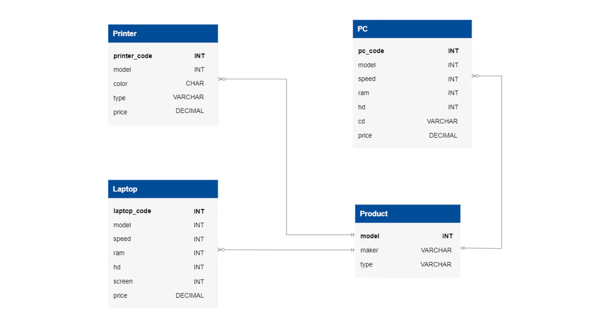

# Computer Store Database

- [Computer Store Database](#computer-store-database)
  - [Learning outcomes](#learning-outcomes)
  - [About](#about)
  - [Stages](#stages)
    - [1: Expensive printers](#expensive-printers)
      - [1.1 Description](#11-description)
      - [1.2 Objectives](#12-objectives)
      - [1.3 Examples](#13-examples)
      - [1.4 Solution](#14-solution)

## Learning outcomes
Learn to write basic queries on MySQL and master the SELECT, FROM, GROUP BY, and WHERE clauses, including summation functions, logical operators, and comparison operators. It will help you learn basic information retrieval in SQL.

## About
As the manager of the computer hardware shop, your primary responsibility is to retrieve data from the existing database efficiently. Accurate data retrieval is crucial for creating reliable financial documents, accounting records, and business reports.

## Stages
### 1: Expensive printers 
<details>
<summary>Find printers with price greater than $200</summary>

#### 1.1 Description
As a computer store manager, staying informed about the store's condition and the products is crucial. It's vital to gather information about expensive items, such as printers, available in limited quantities. This will help you manage inventory effectively and ensure you offer your customers the best products possible.

#### 1.2 Objectives
- Identify printers in your inventory that are priced over $200;
- Find the `model` number, `type`, and `price` of the `Printer`. The order of the columns matters.

Take a look at the following database structure:


Explanation of database
The `Product` table stores information about manufacturers (`maker`), model numbers (`model`), and product types (`type`). The model numbers in the `Product` table are unique across all manufacturers and product types.

The `PC` table contains information about each personal computer, identified by a unique code (`pc_code`). A PC model is indicated using a foreign key to the Product table (`model`). Other specifications include the processor speed (`speed`) in megahertz, memory size (`ram`) in megabytes, hard disk capacity (`hd`) in gigabytes, the CD reader speed (`cd`) such as `DVD`, and the price (`price`) in dollars.

The `Laptop` table is similar to the PC table, but instead of the CD reader speed, it includes the screen size (`screen`) in inches.

The `Printer` table provides information about each printer model, such as whether it is color (`color`, indicated by `C` for color printers and `B` for black printers), the printer type (`type`, which can be `Laser` for laser printers, `Jet` for inkjet printers, or `Matrix` for matrix printers), and the price (`price`) in dollars.

Click on the [link](https://stepik.org/media/attachments/lesson/853275/Computer_Store.sql) to download the SQL query for creating the database.

#### 1.3 Examples
```sql
SELECT model, ...;
```

#### 1.4 Solution
[solution-01](./s01.sql)

</details>

### 2: Marketable laptops  
<details>
<summary>Find laptops with at least 1000GB</summary>

#### 2.1 Description
You've discovered that laptops with at least 1000 GB of hard disk capacity and decent speed are selling well. Find out which manufacturer produces laptops with at least 1000 GB of disk size.

#### 2.2 Objectives
- Obtain a list of manufacturers (`maker`) that produce laptops with a hard disk (`hd`) space of at least 1000 GB, along with the speed (`speed`), the price (`price`), and the model (`model`) of those laptops;
- Find the `maker` and `model` of the laptop from the table `Product`, and the `hd`, `speed`, and `price` from the table `Laptop`. Order output first by `hd`, then by descending order `speed`, and then by `price`.

#### 2.3 Examples
```sql
SELECT product.maker, ...;
```

#### 2.4 Solution
[solution-02](./s02.sql)

</details>

### 3: Uniques  
<details>
<summary>Unique manufacturers</summary>

#### 3.1 Description
As a computer store manager, your next task is identifying unique product manufacturers delivering only one model. By sorting the manufacturers according to their special characteristics, you can determine if these one-product producers are essential to your supply chain. If they are not, you may consider cutting off their supplies.

#### 3.2 Objectives
- Using the `Product` table, determine the number of manufacturers producing one product model;
- Output the `Number` of unique manufacturers from the `Product` table.

#### 3.3 Examples
_Product Table Example_:

model|maker|type
-|-|-
1001|Apple|Laptop
1002|Apple|Laptop
2001|Acer|PC
3001|HP|Printer
3002|HP|Laptop
4001|Samsung|Printer
5001|Lenovo|PC
5002|Lenovo|PC
5003|Lenovo|Laptop

From the above table, it can be observed that only `Acer` and `Samsung` manufacturers produce one model. Therefore, based on the provided data, the `Number` of unique manufacturers is `2`.

_Beginning of the code_:
```sql
SELECT COUNT(maker) as number_of_unique_makers...;
```

#### 3.4 Solution
[solution-03](./s03.sql)

</details>

### 4: Trust no one 
<details>
<summary>Find the maker that produces computer models</summary>

#### 4.1 Description
Once you have identified the one-product manufacturers, the next step is identifying untrustworthy ones that supply subpar products. As a computer store manager, one way to identify unreliable manufacturers is to look for those that produce slow PCs or laptops. This can be a helpful strategy in determining which manufacturers to avoid in the future and ensuring that your store only stocks high-quality products.

#### 4.2 Objectives
- Find the `maker` that produces computer models (this includes `Laptops` and `PCs`) with the lowest speed;
- Output the `maker` and `model` information from the `Product` table, along with the `speed` and `price` details from either the `Laptop` or `PC` table.

#### 4.3 Examples
```sql
WITH my_table AS (SELECT a.maker, a.model, b.speed ...;
```

#### 4.4 Solution
[solution-04](./s04.sql)

</details>

[<<](../../../README.md)

<!--
:%s/\(Sample \(Input\|Output\) \d:\)\n\(.*\)/```\r\r**\1**\r```\3/gc
### 0:  
<details>
<summary></summary>

#### 0.1 Description

#### 0.2 Objectives

#### 0.3 Examples

#### 0.4 Solution
[solution-00](./s00.sql)

</details>

-->

