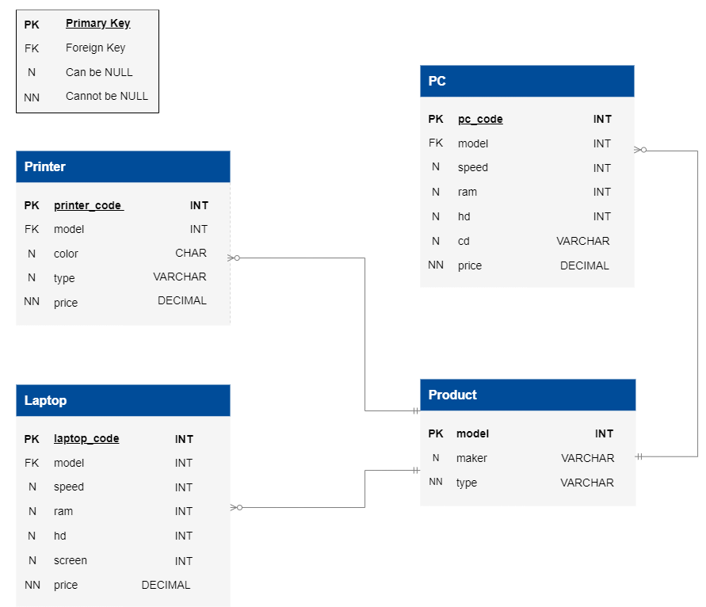

# Electronics Store Customer

- [Electronics Store Customer](#electronics-store-customer)
  - [Learning outcomes](#learning-outcomes)
  - [About](#about)
  - [Stages](#stages)
    - [1: Fast PCs](#1-fast-pcs)
      - [1.1 Description](#11-description)
      - [1.2 Objectives](#12-objectives)
      - [1.3 Examples](#13-examples)
    - [2: Average printer price](#2-average-printer-price)
      - [2.1 Description](#21-description)
      - [2.2 Objectives](#22-objectives)
      - [2.3 Examples](#23-examples)
    - [3: Total cost of laptops](#3-total-cost-of-laptops)
      - [3.1 Description](#31-description)
      - [3.2 Objectives](#32-objectives)
      - [3.3 Examples](#33-examples)
    - [4: PCs and laptops](#4-pcs-and-laptops)
      - [4.1 Description](#41-description)
      - [4.2 Objectives](#42-objectives)
      - [4.3 Examples](#43-examples)
    - [5: High-end laptop vs. PC Prices](#5-high-end-laptop-vs-pc-prices)
      - [5.1 Description](#51-description)
      - [5.2 Objectives](#52-objectives)
      - [5.3 Examples](#53-examples)

## Learning outcomes
Starting with basic SQL operations like `SELECT`, `FROM`, `GROUP BY`, and `WHERE`, we'll explore summation functions, logical operators, and comparison operators and advance into more complex concepts like window functions, subqueries, and join statements. This learning journey will empower you with the skills necessary for proficient information retrieval in SQL.

## About
As a customer of an electronic store, the main objective is to utilize the store's interface to acquire information. This will assist in discovering the most functional and affordable devices that match the individual's specific requirements and preferences.

## Stages
### 1: Fast PCs
#### 1.1 Description
As a customer interested in PCs, you are determined to find models that provide a well-balanced mix of adequate RAM and high-speed performance. You prefer computers with at least 16 GB of RAM but are unaware of the fastest models. To ensure a quick and effective computing experience, you aim to discover the optimal PCs that satisfy both requirements.

#### 1.2 Objectives
- Identify the `pc_code`, `model`, `speed`, and `ram` of PCs from the market database with 16 GB of RAM or more. Ensure the results are sorted primarily by `ram` in ascending order and secondarily by `speed` in descending order. The column order is essential.

Take a look at the following database structure:


Explanation of the database:

- The `Product`** table stores information about manufacturers (`maker`), model numbers (`model`), and product types (`type`). The model numbers in the `Product` table are unique across all manufacturers and product types.
- The `PC`** table contains information about each personal computer, identified by a unique code (`pc_code`). A PC model is indicated with a foreign key to the Product table (`model`). Other specifications include processor speed (`speed`) in megahertz, memory size (`ram`) in megabytes, hard disk capacity (`hd`) in gigabytes, the CD reader speed (`cd`) such as `DVD`, `Blu-ray`, or `None`, and the price (`price`) in dollars.
- The `Laptop`** table is similar to the `PC` table, but instead of the CD reader speed, it includes the screen size (`screen`) in inches.
- The `Printer`** table provides information about each printer model, such as whether it is color (`color`, indicated by `C` for color printers and `B` for black printers), the printer type (`type`, which can be `Laser` for laser printers, `Inkjet` for inkjet printers, and `Matrix` for matrix printers), and the price (`price`) in dollars.

** _Table names are case sensitive_

Click on the [link](https://cogniterra.org/media/attachments/lesson/30429/Updated_Electronic_Store_Database.sql) to download the SQL query for creating the database.

#### 1.3 Examples
_PC Table Example_
pc_code|model|speed|ram
:-:|:-:|:-:|:-:
1|101|2200|8
2|102|2000|16
3|101|2300|8
4|103|2500|16
5|104|2100|8

_From the data presented in the table above, it is evident that PCs with pc_codes 2 and 4 possess ram sizes equal to or greater than 16 GB. The output of the table after identifying PCs having ram sizes equal to or greater than 16 GB:_
pc_code|model|speed|ram
:-:|:-:|:-:|:-:
4|103|2500|16
2|102|2000|16

_From the output above, it can be seen that the order of the columns is pc_code-> model -> speed -> ram_

_Query template:_
```sql
SELECT pc_code, model, speed, ram ...;
```

<hr/>

### 2: Average printer price
#### 2.1 Description
Once you have finished your search for PCs, your next objective is to look for a printer that fulfills your requirements. You are specifically looking for inkjet printers that can print in color. Your primary focus is to determine the average price of printers in this category.

#### 2.2 Objectives
- Identify the average price of printers having the `Inkjet` type and `C` color from the `Printer` table. Round the result up to 2 decimal places.

#### 2.3 Examples
_Printer table:_
printer_code|price|color|type
:-:|:-:|:-:|:-:
1| 	300| 	C| 	Inkjet
2| 	400| 	B| 	Inkjet
3| 	500| 	B| 	Matrix
4| 	200| 	C| 	Laser
5| 	400| 	C| 	Inkjet

_The table shows that printers with `printer_code` `1` and `5` have `C` for `color` and `Inkjet` for `type`. After filtering for printers with these specific color and type criteria, here is the updated table:_
printer_code| 	price| 	color| 	type
:-:|:-:|:-:|:-:
1| 	300| 	C| 	Inkjet
5| 	400| 	B| 	Inkjet

_The average price of these Printers is `350`. When rounded to two decimal places, the final output is:_
average_price|
:-:|
350.00|

Query template:
```sql
SELECT ** write your code here ** AS average_price ...;
```
<hr/>

### 3: Total cost of laptops
#### 3.1 Description
After learning about electronic devices and their specifications, it is time to study their pricing. Your interest lies in understanding the price distribution among laptops from various manufacturers. Your objective is to calculate the total price of each maker's model.

#### 3.2 Objectives
- Identify the total price of all laptop models produced by each maker. Find the `maker` in the `Product` table and `SUM` of the prices in `Laptop` as `total_price`. Ensure the results are sorted by `total_price` in ascending order. Use `GROUP_BY` and `SUM` functions to solve this

#### 3.3 Examples
_Laptop Table example_
laptop_code| 	model| 	price
:-:|:-:|:-:
1| 	101| 	500
2| 	103| 	300
3| 	101| 	350
4| 	103| 	250
5| 	104| 	200

_Product Table Example:_
maker| 	model
:-:|:-:
Apple| 	101
Apple| 	102
Samsung| 	103
Samsung| 	104

_The tables above are interconnected using the `model` number as a key. For instance, when calculating the total price of the `Apple` laptop models, we add the prices of two distinct models (500 + 350) to arrive at a total of 850. It's important to note that only the price associated with model number `101` is included in this calculation since it was retrieved from the `Laptop` table. Final output:_
maker| 	total_price
:-:|:-:
Samsung| 	750
Apple| 	850

_Keep in mind that the final output should be sorted in ascending order based on the `total_price` value._

Query template:
```sql
SELECT maker,
       ** write your code here ** AS total_price
       ...;
```
<hr/>

### 4: PCs and laptops
#### 4.1 Description
Now, as a customer looking to gain a deeper understanding of electronic device brands available on the market, you want to identify makers that produce PCs and Laptops.

#### 4.2 Objectives
- Identify manufacturers producing PCs and laptops, then count their production quantities. Find the `maker` in the `Product` table, `COUNT` the number of PC-type models it produces as `pc_count`, and `COUNT` the number of laptop-type models it produces as `laptop_count`. Use `GROUP_BY` and `SUM` functions to solve this task. The order of the columns matters.

#### 4.3 Examples
_Product table example:_
model| 	maker| 	type
:-:|:-:|:-:
1| 	LG| 	PC
2| 	HP| 	Printer
3| 	Sony| 	Laptop
4| 	LG| 	Laptop
5| 	Sony| 	Laptop
6| 	HP| 	PC

_The table counting the models which are laptop-type and PC-type by makers:_
maker| 	pc_count| 	laptop_count
:-:|:-:|:-:
LG| 	1| 	1
HP| 	1| 	0
Sony| 	0| 	2

_From the above table, only LG produces both PC and Laptop type models:_
maker| 	pc_count| 	laptop_count
:-:|:-:|:-:
LG| 	1| 	1

Query template:
```sql
SELECT maker,
       ** write your code here ** AS pc_count
       ** write your code here ** AS laptop_count
...;
```

<hr/>

### 5: High-end laptop vs. PC Prices
#### 5.1 Description
As a customer, you've heard that laptops tend to be more expensive than PCs. To verify this claim, you want to identify specific laptop models priced higher than the most costly PCs currently on the market. Also, to better understand the laptop price trends, compare average laptop and PC prices with those that cost more than the most expensive PC.

#### 5.2 Objectives
- Identify the laptops priced higher than any PC, including model, maker (`Product` table), and price. Also, compute the differences: laptop vs. most expensive PC as `price_difference_max_pc` and laptop vs. average laptop price as `price_difference_avg_laptop`. The order of the columns matters.

#### 5.3 Examples
_PC table example:_
pc_code| 	model| 	speed| 	ram| 	price
:-:|:-:|:-:|:-:|:-:
1| 	101| 	2200| 	8| 	300
2| 	102| 	2000| 	16| 	450
3| 	101| 	2300| 	8| 	330
4| 	103| 	2000| 	8| 	280
5| 	104| 	2100| 	8| 	290

_The highest price of a PC from the table above is 450._

_Laptop table example:_
laptop_code| 	model| 	maker| 	price
:-:|:-:|:-:|:-:
1| 	101| 	LG| 	400
2| 	102| 	HP| 	460
3| 	101| 	LG| 	350
4| 	103| 	Apple| 	500
5| 	104| 	Lenovo| 	390

_The table reveals that laptops with codes `2` and `4` are priced higher than the highest-priced PC (450). The average laptop price is calculated as (400 + 460 + 500 + 350 + 390) / 5 = 420. Final output:_
model| 	maker| 	price| 	price_difference_max_pc| 	price_difference_avg_laptop
:-:|:-:|:-:|:-:|:-:
102| 	HP| 	460| 	10| 	40
102| 	Apple| 	500| 	50| 	80

Query template:
```sql
SELECT model, maker, price
       **write your code here** AS price_difference_max_pc
       **write your code here** AS price_difference_avg_laptop
...;
```

<hr/>
